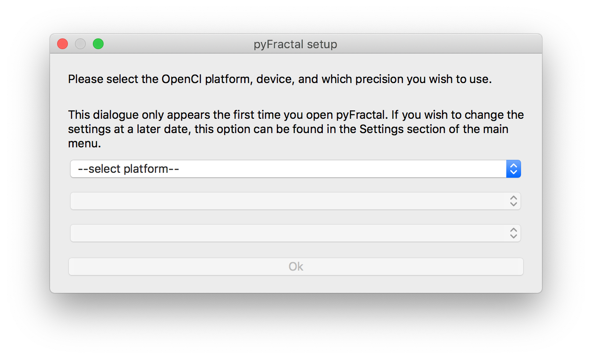
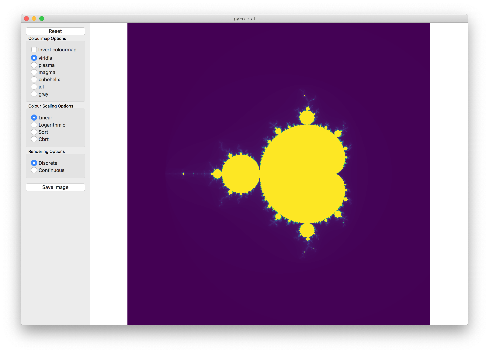
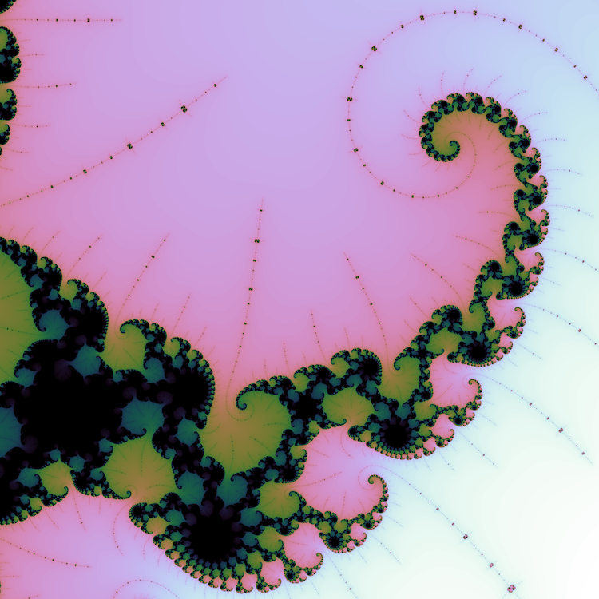
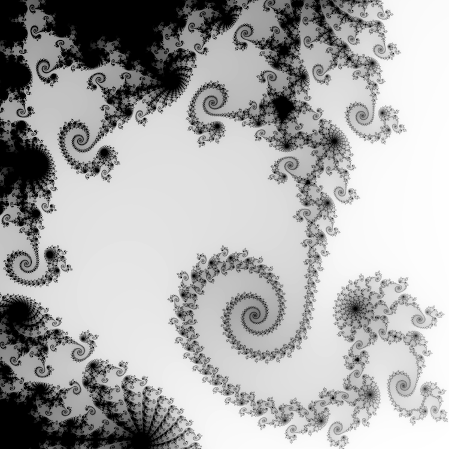
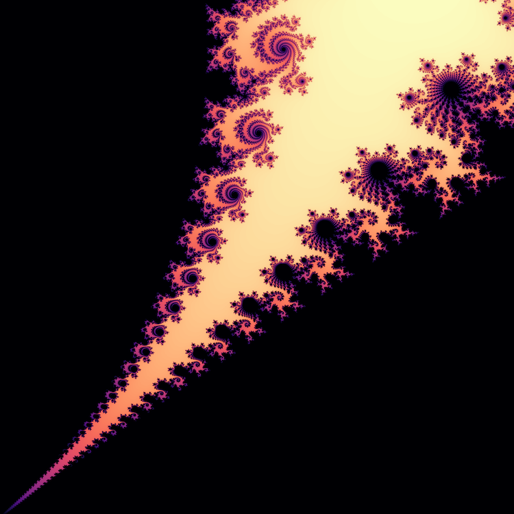
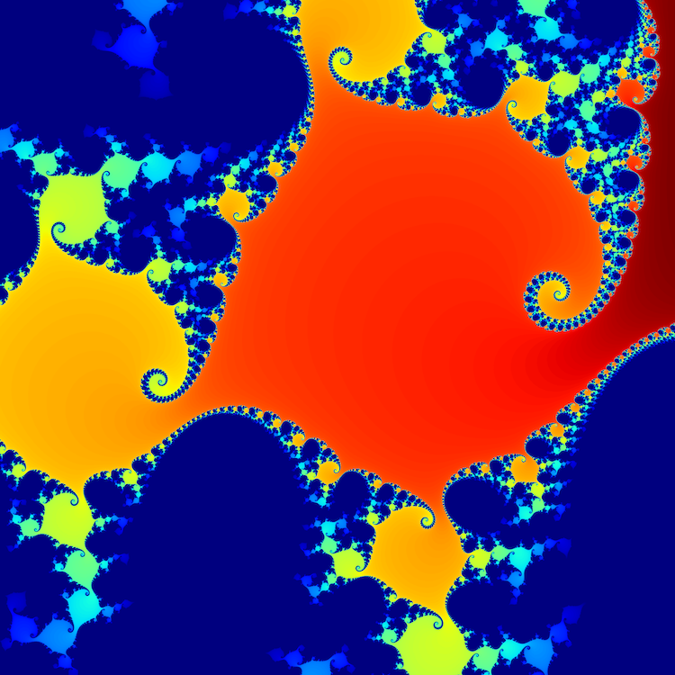
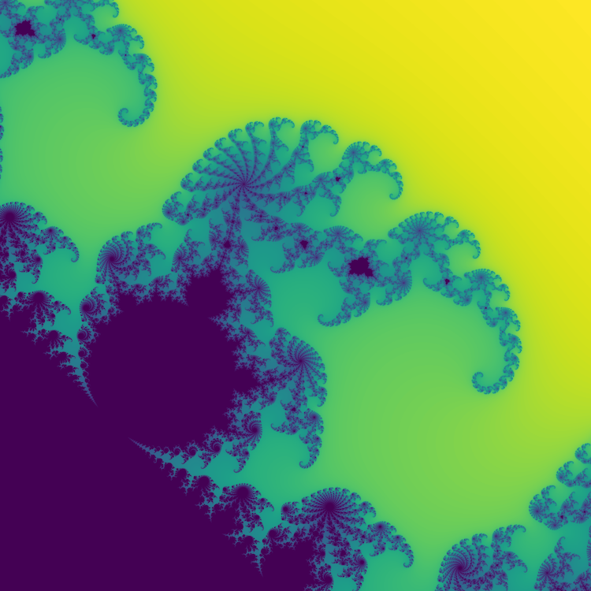
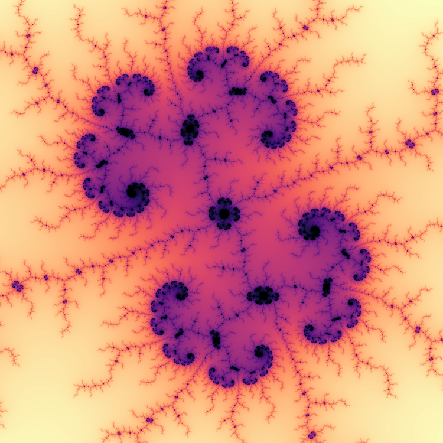

# pyFractal - A GUI Mandelbrot Viewer

pyFractal is a GUI application that allows the user to explore the Maldelbrot set. The user can save high resolution images, and re-load these images back into pyFractl. It is written in Python, using the PyQt5 toolkit for the GUI, Matplotlib for the visualisation, with the Mandelbrot set being calculated using OpenCL (with a Numba accelerated fallback if no suitable OpenCL device/platform is found).

## Brief introduction to the Mandelbrot Set
The Mandelbrot set is defined as the set of complex numbers C = x + iy where the function f(z) = z2 + C when iterated infinitely many times (with initial z = 0) does not diverge. This is impossible to compute accurately as it is impossible to iterate something infinitely many times, however we can approximate this by testing convergence after a set number of iterations.

For pyFractal, we set this number of iterations to be 256, so any point which has not diverged after this number of iterations is deemed to be on the set. Our condition for divergence is if the absolute value of Z is greater than 2. With this definition, points either belong to the set, or do not. Considering a finite grid of points C = x + iy on the complex plane, we can produce an image of the fractal by colouring these points according to whether they belong to the set or not. This image is rather bland however, as it consists of only two colours. We instead colour the pixels by how many iterations that are required before they diverge, so we can have values ranging from 0 to 255 and produce a colourful picture.

The above method leads to discrete valuing of pixels (e.g. 0-255) which results in steps in the image. One way to get around this is to value the pixel according to 

Pixel value = n + 2. - log(log(|z|2))/log(2)

Where n is the number of iterations, z is the value of the pixel at n iterations, and all the logarithms natural logarthms (e.g. base e). This results in continuous pixel values between 0 and 255, and therefore an image with no steps in it.

## Requirements
pyFractal has been confirmed to work on Windows 10, macOS and Linux. It is easiest to meet all the requirements using Anaconda python, however it is possible meet the requirements using stock python and pip.

- Python 3 (tested on v3.7.6)
- Numpy (tested on v1.18.5)
- Matplotlib (tested on v3.2.1)
- PyQt5 (requires at least v5.15.0)
- pyopencl (tested on v2020.1)
- Numba (tested on v0.49.1)

## Usage
To launch pyFractal, run `python pyFractal.py` from the command line. On macOS you need to launch it with `pythonw`. 

The first time it is run, you will be presented with a window allowing you to set the OpenCL options like this:

You can pick the platform (the OpenCL implementation), the device (the hardware to run the OpenCL kernel on) and the numerical precision to use. Single precision allows you to zoom in by a factor of around 106, whilst double precision allows you to zoom in to around 1012. The computation is faster with single precision than double precision. You can therefore also choose automatic precision switching, which will switch to double precision once you have reached a certain zoom. On some older discrete GPUs and on most integrated GPUs, you may only be able to choose to use single precision.

If you do not have any OpenCL devices or platforms, you can choose to not use OpenCL. This will instead use a python function to calculate the Mandelbrot set. This will be slower than using OpenCL.

Once you have selected your preferences, you will be brought to the main screen:

Where the fractal is displayed in the right of the window, and some options appear in the left. Clicking and dragging on the fractal will pan the image. Left clicking the image will zoom in by a factor of two on that point, and right clicking will zoom out by a factor of two.

The options on the left hand sise of the window are as follows:

### Reset button
Resets the view.

### Colourmap Options
Allows the user to select the colourmap. The 'invert colourmap' checkbox allows the user to reverse the color mapping.

### Colour Scaling Options
Modifies how the values of the image pixels are mapped to the colours. The options are:
 - Linear: colour proportional to pixel value
 - Logarithmic: colour proportional to log(pixel value)
 - Sqrt: colour proportional to (pixel value)2
 - Cbrt: colour proportional to (pixel value)3

### Rendering Options
Choose whether to use discrete pixel values or continuous pixel values.

### Save Image
Saves a high resolution (4000 x 4000 pixel) PNG image of the current view. This image contains metadata describing the view so that the image can be read into pyFractal to _restore_ the view to that of the image.

### Menu bar
#### File > Load Image
Loads in a PNG image written by pyFractal and restores the view to that of the image.
#### Settings > Change OpenCL Settings
Brings up the OpenCL settings window that appears upon first launching pyFractal.

## Example Images
Below are some example images generated by pyFractal. They have been rescaled down to 750 x 750 pixels.

